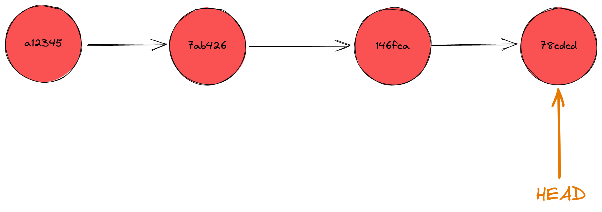
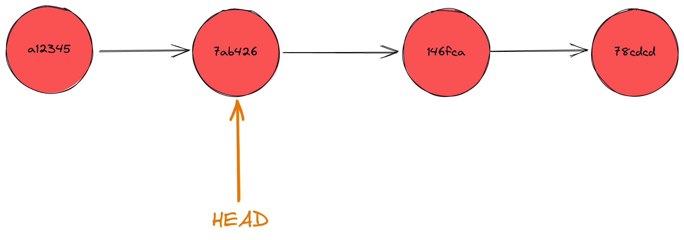

# <!--fit--> Versionskontrolle mit Git

Eine Einführung

https://github.com/yhatt/marp-cli-example

---

<div class="grid grid-cols-2 gap-4">
    <div>

## Motivation

- bachelorarbeit.pdf
- bacheloarbeitV2.pdf
- bachelorarbeitV2-final.pdf

    </div>
    <div>

## Versionskontrolle

- Organisations von Änderungen
- Ziele:
  - Nachvollziehbare Änderungen
  - Zugriff auf alte Versionen
  - Austauschen von Änderungen

    </div>
</div>

---

# Steckbrief

- 2005 von Linus Torvalds initiiert
- Hat nahezu alle alternativen verdrängt [1]
- Entwicklung des Linux-Kernels
- Dezentralität
  - Jeder Nutzer besitzt vollständige Kopie


<sub>[1] [StackOverflow Developer Survey 2022](https://survey.stackoverflow.co/2022/#section-version-control-version-control-systems)</sub>


---

# Erste Schritte

<div class="grid grid-cols-2 gap-4">
<div>

## Installation

**Windows**
<https://git-scm.com/download/win>

**OSX**
homebrew: <https://brew.sh/>
```sh
brew install git git-gui
```
**Linux**
Spezifischen Paketmanager nutzen, um `git` zu installieren

</div>
<div>

## Grafische Oberflächen

- `git-gui` / `gitk` (Built-In)
- TortoiseGit
- GitKraken
- Visual Studio Code / IntelliJ

    </div>
</div>

--- 

# Wer bin ich?

```sh
git config --global user.name "Tobias Hund"
git config --global user.email "tobias.hund@innovation-hub.de"
```

--- 

# Git Repository einrichten

- Repository ist ein versionierter Arbeitsbereich (Dateiverzeichnis)
- Repositories können mit einem Server synchronisiert werden
- Erzeugt oder bestehende verwendet

<div class="grid grid-cols-2 gap-4">
<div>

```sh
mkdir git-repo
cd git-repo
git init
```

</div>
<div>

```sh
git clone git@github.com:twobiers/talks.git
git clone https://github.com/twobiers/talks.git
```

</div>
</div>

---

# Commits und Arbeitszyklus

## Commits

 - Verwaltungseinheit vom Code
 - Atomare Änderung
 - Bestandteile:
   - Autor
   - Datum
   - Nachricht ("Was wurde warum geändert?")
   - Zeiger auf vorhergehenden Commit-Hash (SHA1)
   - Code-Änderungen ("Diffs")

---

## Aufbau eines Commits

```
$ git log
commit 598b8c01a39d0c0ef3e965a3622c1e439be4ced6 (HEAD -> main)
Author: twobiers <22715034+twobiers@users.noreply.github.com>
Date:   Wed Nov 9 20:07:38 2022 +0100

    initialize git speaker deck
```

--- 

* Commits basieren auf commits
* Intern verkettete Liste


---

* Spezieller HEAD Zeiger, zeigt aktuellen "Ort"



---

* Kann verschoben werden



---

TODO:
- Staging Area
- How to commit
- branches
- revert/reset
- merge
- diff

---
# Best Practices
## `push --force` vermeiden.

* Überschreibt Änderungshistorie
* Destruktive Aktion
* Bearbeiter können mit ihrer Arbeit auf existierenden Commits basieren, die gelöscht werden

## Keine temporären Dateien einchecken
- z.B. Editor-Dateien, `Thumbs.db`, `.DS_STORE`
- Oder `node_modules`
- `.gitignore` zum Ignorieren (<https://gitignore.io>)

---
# Best Practices
## Kleine, spezifische Commits
- Kleinschrittiges Commiten
- Aussagekräftige Commit-Nachricht

## Keine Geheimnisse einchecken
- Schwer, aus alten Commits zu entfernen
- Ggf. trotzdem rekonstruierbar (`git reflog`)

---
# Best Practices
## Conventional Commits
```
<type>[optional scope]: <description>

[optional body]

[optional footer(s)]
```
<https://www.conventionalcommits.org/>